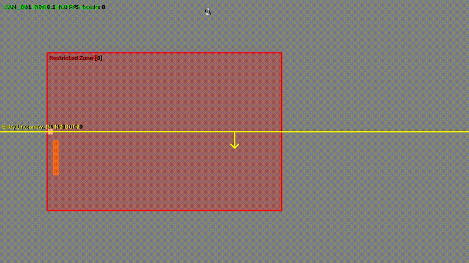

# Border AI: AI Video Intelligence Platform

Real-time video analytics for existing CCTV/IP-camera infrastructure: detection,
tracking, restricted-zone and line-crossing events, and (in progress) ANPR,
watchlists, behaviour rules, threat scoring, and an investigation dashboard.



## Status
**Week 1 complete (v0.1-week1):** video/RTSP ingestion, YOLO detection,
ByteTrack tracking, zones and virtual lines with events, annotated output.
Weeks 2-4: intelligence layer, dashboard, testing and deployment.

## What it does
- Ingests video files and RTSP streams from multiple cameras
- Detects people and vehicles (YOLO), tracks them with persistent IDs (ByteTrack)
- Config-driven restricted zones and virtual lines: ENTER / EXIT / DWELL / LOITERING /
  LINE_CROSSING with direction, with duplicate suppression
- Produces annotated video, structured JSON events, and live statistics
- Optional HTTP API with MJPEG streams, snapshots, and recent events

## Architecture
```text
Cameras / RTSP / Video files
        ↓
Video Ingestion (thread per camera, bounded queues)
        ↓
Batched Detection (YOLO)  →  per-camera Tracking (ByteTrack)  →  Rule Engine (zones, lines)
        ↓                                                              ↓
Annotated Video + MJPEG stream                          Events (JSON Lines)
```

## Quick start
```bash
cp .env.example .env
docker compose up -d                      # PostgreSQL + Redis (used from Week 2)
python -m venv .venv && source .venv/bin/activate
pip install -e video-ingestion
pip install -r ai-engine/requirements.txt
cd ai-engine
python scripts/run_pipeline.py --source ../datasets/videos/<clip>.mp4 --camera-id CAM_001
```
Results appear in `outputs/runs/<run_id>/` (annotated MP4, `events.jsonl`, `summary.json`, `manifest.json`).

Draw zones and lines interactively: `python scripts/draw_zones.py --video ../datasets/videos/<clip>.mp4 --camera CAM_001`

## Results (Week 1)
| Scenario | Cameras | FPS per camera | Notes |
|---|---|---|---|
| Single clip (offline, video written) | 1 | 19.9 FPS | Zero drops, CPU execution (`yolov8n @ 640px`) |
| Dual clip (offline, video written) | 2 | 10.4 FPS | Dynamic batched inference (avg batch 1.97), zero drops |
| 3 cameras (live, RTSP + files, no video) | 3 | 9.5 FPS | Resilient auto-reconnect, bounded ~200ms latency |
| 3 cameras (live, RTSP + files, with video) | 3 | 9.1 FPS | Real-time multi-threading, CPU RSS stable ~470 MB |

Model: YOLOv8n @ 640px, FP32 on Apple Silicon / CPU. Detailed benchmarks and methodology: [docs/benchmarks.md](docs/benchmarks.md).

## Event example
```json
{
  "event": "LINE_CROSSING",
  "type": "LINE_CROSSING",
  "camera_id": "CAM_001",
  "track_id": 17,
  "direction": "IN",
  "timestamp": "2026-10-08T05:23:41.120Z",
  "object": {
    "class": "person",
    "confidence": 0.912,
    "bbox": [140.0, 110.0, 180.0, 170.0]
  },
  "rule": {
    "id": "L1",
    "name": "Entry Line",
    "kind": "line",
    "type": "tripwire"
  }
}
```

## Repository layout
- `ai-engine/`: AI pipeline, YOLO detection, ByteTrack tracking, spatial rules, and FastAPI serving.
- `video-ingestion/`: Multi-camera management, RTSP source reconnect logic, and file pacing.
- `configs/`: Declarative `cameras.json`, `app.yaml`, and per-camera zone rules in `configs/zones/`.
- `docs/`: Design notes, Architectural Decision Records (ADRs 0001–0006), benchmarks, and known issues.
- `backend/` & `frontend/`: Node.js Express service and React operator dashboard (Weeks 3–4).

## Known limitations
See [docs/known_issues.md](docs/known_issues.md).

## Responsible use
Use only footage you are authorized to process. Retention, access control, and legal compliance are the responsibility of the deploying organization. Make sure the privacy of people is not violated.

## Roadmap
- **Week 2:** ANPR (vehicle → plate detection → PaddleOCR → consensus), watchlists, face/Re-ID prototype, behaviour rules, threat scoring, Redis event streaming, PostgreSQL schema.
- **Week 3:** Node.js backend API, WebSocket alert broadcaster, React investigation dashboard.
- **Week 4:** End-to-end integration testing, system soak tests, containerized production deployment.
