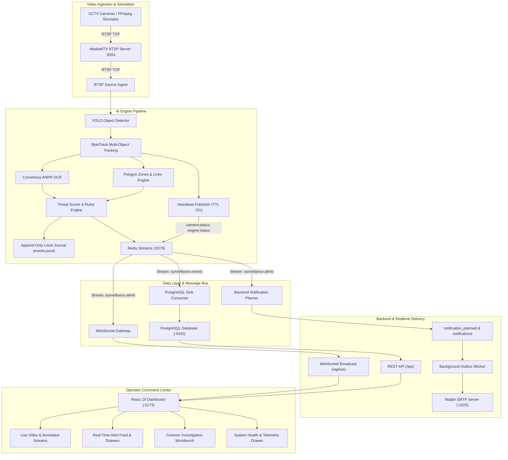

# Border-AI Implemented System Architecture (Week 3)

This diagram visualizes the fully integrated, running system architecture at the end of Week 3 (Day 21).

```mermaid
flowchart TD
    subgraph Ingestion ["Video Ingestion & Simulation"]
        CCTV["CCTV Cameras / FFmpeg Simulator"] -->|RTSP TCP| MediaMTX["MediaMTX RTSP Server :8554"]
        MediaMTX -->|RTSP TCP| RTSPSource["RTSP Source Ingest"]
    end

    subgraph AIEngine ["AI Engine Pipeline"]
        RTSPSource --> YOLO["YOLO Object Detector"]
        YOLO --> Tracker["ByteTrack Multi-Object Tracking"]
        Tracker --> ANPR["Consensus ANPR OCR"]
        Tracker --> Zones["Polygon Zones & Lines Engine"]
        Tracker --> Heartbeat["Heartbeat Publisher (TTL 15s)"]
        ANPR --> Scorer["Threat Scorer & Rules Engine"]
        Zones --> Scorer
        Scorer --> Journal["Append-Only Local Journal (events.jsonl)"]
        Scorer --> RedisBus["Redis Streams (:6379)"]
    end

    subgraph DataLayer ["Data Layer & Message Bus"]
        RedisBus -->|Stream: surveillance.events| Sink["PostgreSQL Sink Consumer"]
        RedisBus -->|Stream: surveillance.alerts| BackendOutbox["Backend Notification Planner"]
        RedisBus -->|Stream: surveillance.alerts| WSGateway["WebSocket Gateway"]
        Sink --> Postgres["PostgreSQL Database (:5432)"]
        Heartbeat -->|camera:status, engine:status| RedisBus
    end

    subgraph Application ["Backend & Realtime Delivery"]
        BackendOutbox --> OutboxTable["notification_planned & notifications"]
        OutboxTable --> Worker["Background Outbox Worker"]
        Worker --> Mailpit["Mailpit SMTP Server (:1025)"]
        WSGateway --> WSStream["WebSocket Broadcast (/api/ws)"]
        Postgres --> RESTApi["REST API (/api)"]
    end

    subgraph UI ["Operator Command Center"]
        WSStream --> ReactApp["React 19 Dashboard (:5173)"]
        RESTApi --> ReactApp
        ReactApp --> LiveGrid["Live Video & Annotated Streams"]
        ReactApp --> AlertsFeed["Real-Time Alert Feed & Drawers"]
        ReactApp --> Investigation["Forensic Investigation Workbench"]
        ReactApp --> SystemChip["System Health & Telemetry Drawer"]
    end
```
